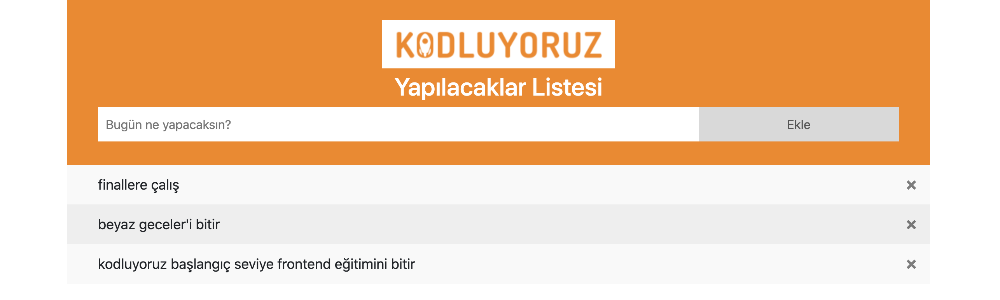
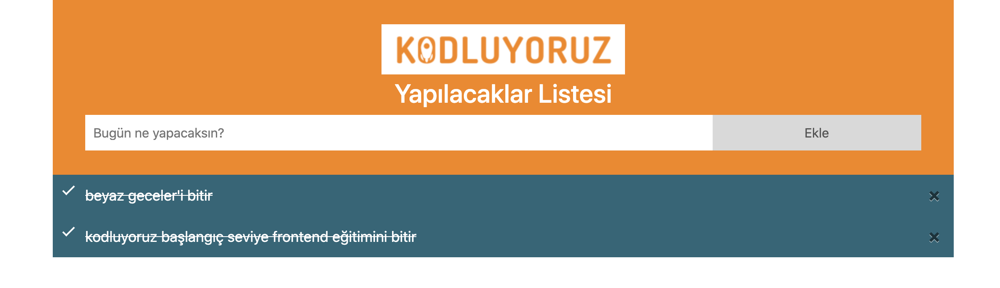
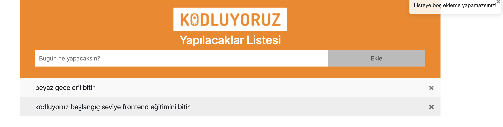

# TodoList-Javascript
Kodluyoruz As part of the FrontEnd Web Development course, I tried to make a To-Do List project dynamic using Javascript, for which HTML and CSS codes were already given.
-----------

+ What to do in the project
   * Unable to add null characters to the list. However, it gives the same error when nothing is written.
   * In the JavaScript code you will write, there must be a function that allows adding elements, a function that allows deleting elements, and a function that allows marking done.
   * You may have noticed that when the element is added and it gives an error, it gives a warning at the top right. It's the Bootstrap Toast manifest that enables it. Go to the page and research how toast is done and add it to your code.
   * Go for the main functions first. Done, toast notification these are for some more artistry. It must fulfill its primary purpose.
   * Do not forget to add the js file you wrote to your project.

---------

+ First, you can clone my project by typing git clone in the terminal.


````
git clone https://github.com/beeyzaozer/TodoList-Javascript

````



-----------

+ We need to add li elements inside our ul tag with + List id. First we create an empty array named items. Then we create the li element dynamically within the CreateItem function.
+ Function that allows us to delete the element we created when the x button is clicked.

````
span.onclick = () => {
            span.parentElement.remove();
        }
````

-----------


+ A function that allows us to cross out the Li element when clicked. Here we make the hidden classList visible with toogle.

````
listBox.addEventListener("click", (item)  => {
    if (item.target.tagName = "li") {
        item.target.classList.toggle("checked");
    }
});

````



----------------------


+ We return every li element we created with the ForEach method to our array.

````
items.forEach((item) => {
    createItem(item);
    });

````

-----------

+ The function where we get the value entered in the input. At the same time, it checks whether the value entered in the input is empty.

````
  if (item.value === "" || item.value === " ") { // if item is empty, show toast error message
            $(".error").toast("show");
            
    }else{  // else show success toast message and run creat function
        $(".success").toast("show");
        createItem(item);    
        
    }
````





